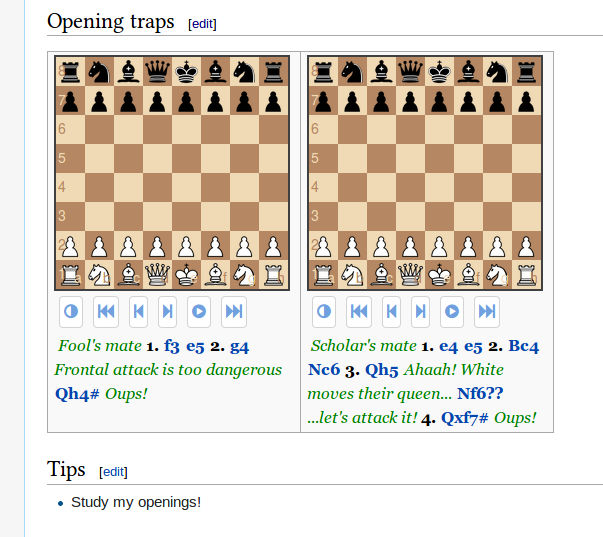

# PgnJS

PgnJS is a MediaWiki extension that embeds chess games (boards and moves) in a wiki page. Chess games are
simply given in PGN format in a `<pgn>` tag and displayed thanks to the powerful javascript engine
[**PgnViewerJS**](https://github.com/mliebelt/PgnViewerJS). In fact most of the functionality is provided
by PgnViewerJS. This extension only implements the parsing of the `<pgn>` tag.

<p align="center"></p>

## Status

Currently this extension is in *alpha* status (still in development). It works for me on my wiki.

Tested on
* Mediawiki 1.27.4.
* Mediawiki 1.22.1.

## Features

* Support the 4 PgnViewerJS **modes**: `board`, `view` (default), `print` and `edit`.
  In print mode, use `$220` NAG to print the board (see example).
* Support the following PgnViewerJS **attributes**:
  * `position` (also in combination with PGN moves),
  * `showNotation`,
  * `orientation`,
  * `theme`,
  * `pieceStyle` (note that default is `merida`),
  * `timerTime`,
  * `locale`,
  * `boardSize`,
  * `movesWidth`, `movesHeight`, and `scrollable`.
* Support CSS styling via standard attribute `style`. This is handy for specifying the DIV width (e.g.
  `style="width: 200px"`).

## Installation

The simplest is to clone the git repository in folder `extensions` of your wiki and run the `install`
target (for MW 1.25 or above) or `install-1.24` (for MW 1.24 or older):

```bash
cd /path/to/your/wiki/extensions
git clone --recursive --depth 1 https://github.com/xeyownt/mwpgnjs PgnJS
cd PgnJS
make install             # For MW 1.25 or above
make install-1.24        # For MW 1.24 or older
```
Don't forget the `--recursive` option since the extension uses git submodules.

`make install` / `make install-1.24` will delete all files that are not necessary for the extension to
run, and add the following line at the end of `LocalSettings.php`:
```php
// For MW 1.25 or above:
wfLoadExtension( 'PgnJS' );
// For MW 1.24 or older:
require_once "$IP/extensions/PgnJS/PgnJS.php";
```

Done! Navigate to `Special:Version` on your wiki to verify that the extension is successfully installed.

## Usage

The extension provides a new tag `<pgn>`.

To embed a new chess game on your page, simply enclose the PGN representation of that game in a `<pgn>`
tag.

Some examples:

Code                  | Result
----------------------|-----------
`<pgn/>` | An empty board
`<pgn>1. f4 e6 2. g4 Qh4</pgn>` | A board with moves
`<pgn>1. f4 e6 2. g4 Qh4 {Oups!}</pgn>` | PGN may include annotation (or variants)
`<pgn style="width: 200px">1. f3 e6 2. g4 Qh4</pgn>` | Some styling
`<pgn mode="print">1. f3 $220 e6 2. g4 Qh4 $220</pgn>` | A board in print mode

More examples in [file pgnjs.wiki](tests/pgnjs.wiki).

## Contribute
See [DEV.md](DEV.md) and [TODO.md](TODO.md).

## Links

* [**PgnJS** extension on MediaWiki](https://www.mediawiki.org/wiki/Extension:PgnJS).
* [**PgnViewerJS** on GitHub](https://github.com/mliebelt/PgnViewerJS).


[//]: # ( vim: set tw=105: )
